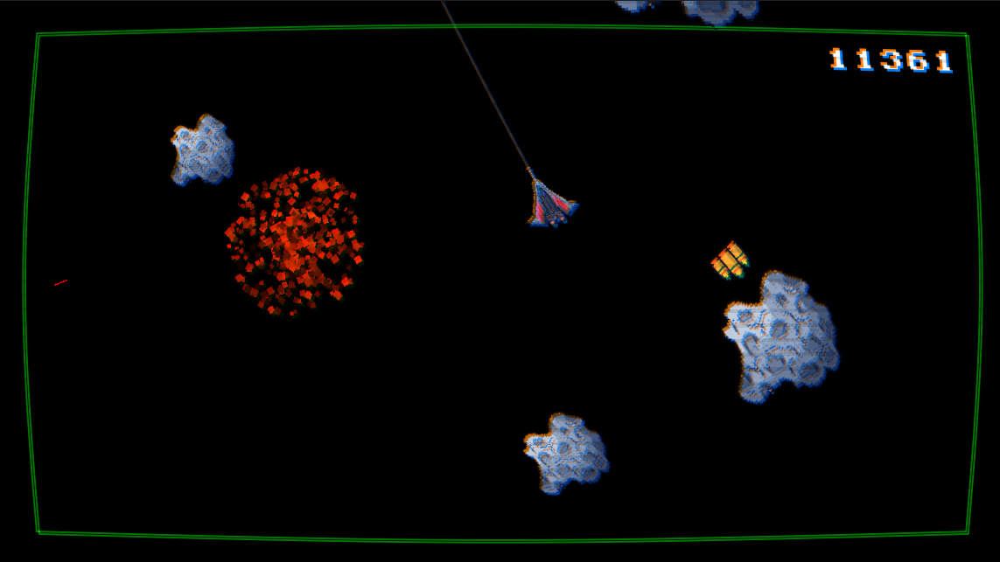

# Spingunner

_"Taistele aikaa vastaan ja pelasta miehistösi: Selviydy meteorisateesta vaurioituneella aluksella!"_

Pelissä pelaaja ohjaa osittain vaurioitunutta avaruusalusta meteorivyöhykkeen läpi. Avaruusalus on hallitsemattomassa kiertoliikkeessä ja ainoa keino meteoreiden väistelyyn on ampua aluksen pääkanuunalla (rekyyli saa aluksen sinkoamaan vastakkaiseen suuntaan). Meteoriitti tuhoutuu ammuksen osuessa siihen. Pelaaja voi myös käyttää pelialueen reunoja kimmottakseen aluksen vastakkaiseen suuntaan. Meteoriittien kokojen, nopeuksien ja kohdistuksen avulla peliä voidaan vaikeuttaa pelin edetessä. Pelaajan tavoite on selvitä mahdollisimman pitkään, joten keräytyvät pisteet ovat verrannollisia aikaan.

